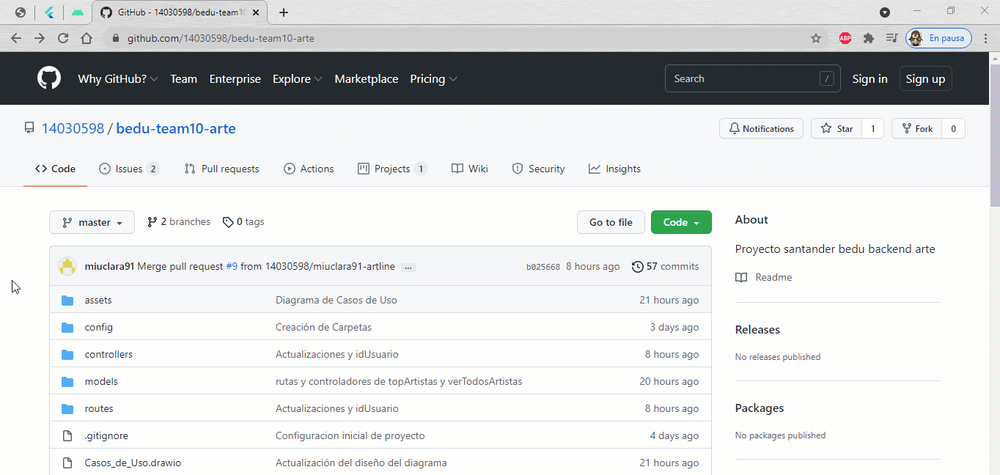

 
Este proyecto consiste en el desarrollo de una API para una red social enfocada al ámbito artístico.:art:
Se busca que esta API tenga acceso a una base de datos de artistas y obras, para así crear una serie de endpoints enfocados a la creación, consulta y edición de dicha información. Todo esto con el fin de crear una comunidad de usuarios que disfrutan de ver y compartir el arte.

## Equipo 10 :wave:
- [Integrantes](https://github.com/14030598/bedu-team10-arte/wiki/Home)

## Estructura del proyecto :file_folder: 
Como parte del desarrollo del proyecto se definieron las Entidades que están involucradas en el proyecto así como una serie de Historias de usuario y Diagrama de Casos de Uso, los cuales pemitieron un planteamiento del proyecto de manera clara y organizada.

Para información más detallada puedes acceder al apartado [Flujo de trabajo](https://github.com/14030598/bedu-team10-arte/wiki/Flujo-de-trabajo) en la Wiki.

## Descripción técnica :computer:
Para el desarrollo de esta API se está haciendo uso de Node.js y MongoDB.
Para información más detallada sobre la estructura de carpetas/archivos y la forma de correr el proyecto puedes acceder al apartado [Flujo de trabajo](https://github.com/14030598/bedu-team10-arte/wiki/Flujo-de-trabajo) en la Wiki.
### Uso Local

_clonando el repositorio para ejecutar un servidor local_

### Uso Remoto
**Aqui va video**

_puedes consumir la API desde heroku en el siguiente [link](https://artline-team10.herokuapp.com/artline) base y la documentación de uso la encuentras en [swagger](https://app.swaggerhub.com/apis-docs/Bedu/artline/1.0.0) o támbien la documentacion generada en [postman](https://documenter.getpostman.com/view/16860488/UUxxfo8j)_

## Toda la documentación se encuentra en la Wiki :book:

- [Historias de usuario](https://github.com/14030598/bedu-team10-arte/wiki/Historias-de-usuario)
- [Requerimientos](https://github.com/14030598/bedu-team10-arte/wiki/Requerimientos)
- [Documentación](https://www.behance.net/gallery/126576155/Case-study-Artline?)
- [Flujo de trabajo (desarrollo)](https://github.com/14030598/bedu-team10-arte/wiki/Flujo-de-trabajo)
